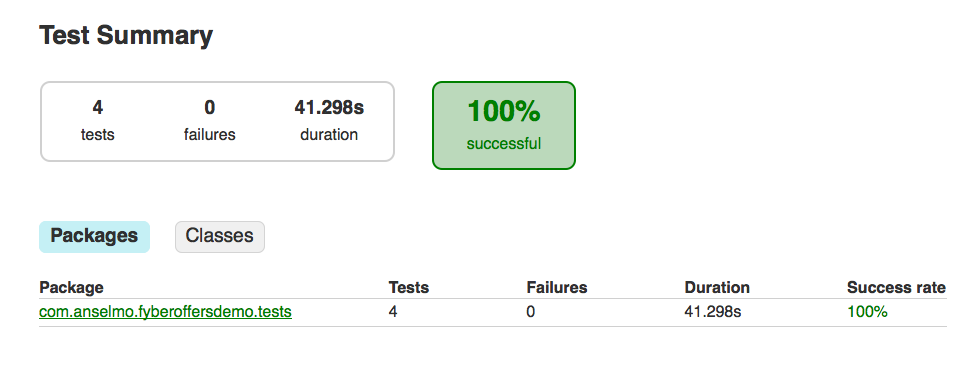
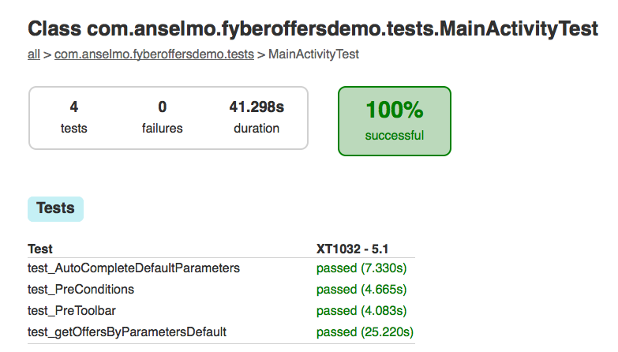

# FyberOffers
=======

A simple client to show information about Fyber offers


Testing
--------

JUnit/Robotium




How to run the tests
--------

```groovy
In Mac:
command: ./gradlew tasks
command: ./gradlew connectedAndroidTest
```